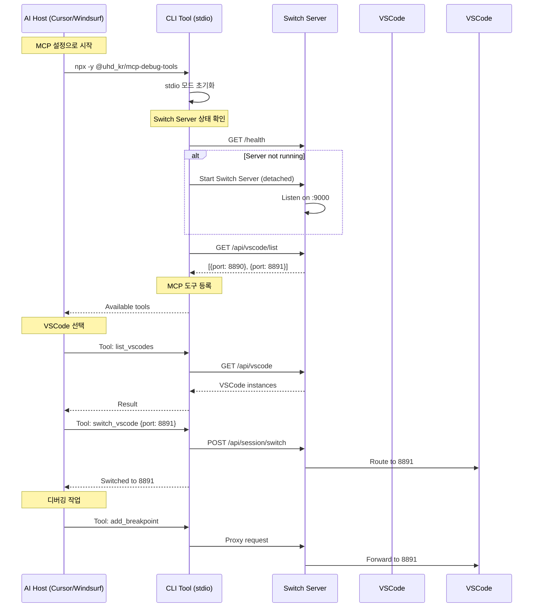

# MCP stdio 기반 Switch Server 통합 설계

## 1. 개요

MCP (Model Context Protocol)은 stdio 기반으로 AI Host와 통신하며, Switch Server를 통해 여러 VSCode 인스턴스를 선택할 수 있도록 설계합니다.

## 2. MCP 설정 구조

```json
{
  "[release]dap-proxy": {
    "timeout": 60,
    "command": "npx",
    "args": ["-y", "@uhd_kr/mcp-debug-tools"],
    "type": "stdio"
  }
}
```

## 3. 시스템 플로우



## 4. CLI Tool MCP 도구 구현

### 4.1 VSCode 관리 도구

```typescript
// cli.ts
export class MCPSwitchTools {
  private switchServerUrl = 'http://localhost:9000';
  private currentSession?: SessionInfo;
  
  registerTools(mcpServer: McpServer) {
    // 1. VSCode 인스턴스 목록 조회
    mcpServer.registerTool(
      'list_vscodes',
      {
        description: 'List all available VSCode instances with their workspaces',
        parameters: {}
      },
      async () => {
        try {
          const response = await fetch(`${this.switchServerUrl}/api/vscode`);
          const vscodes = await response.json();
          
          if (vscodes.length === 0) {
            return { 
              content: 'No VSCode instances available. Please open VSCode with the DAP Proxy extension.' 
            };
          }
          
          const list = vscodes.map((vs: VSCodeInfo, index: number) => 
            `${index + 1}. Port ${vs.port}: ${vs.workspace} (${vs.status})`
          ).join('\n');
          
          return {
            content: `Available VSCode instances:\n${list}\n\nCurrent: ${this.currentSession?.port || 'None'}`
          };
        } catch (error) {
          return { 
            content: `Error: Switch Server not available. ${error.message}` 
          };
        }
      }
    );
    
    // 2. VSCode 인스턴스 선택/전환
    mcpServer.registerTool(
      'switch_vscode',
      {
        description: 'Switch to a different VSCode instance',
        parameters: {
          port: {
            type: 'number',
            description: 'Target VSCode port number',
            required: true
          }
        }
      },
      async ({ port }) => {
        try {
          const response = await fetch(`${this.switchServerUrl}/api/session/switch`, {
            method: 'POST',
            headers: { 'Content-Type': 'application/json' },
            body: JSON.stringify({ 
              targetPort: port,
              sessionId: this.currentSession?.id 
            })
          });
          
          if (response.ok) {
            const result = await response.json();
            this.currentSession = result.session;
            return {
              content: `✅ Switched to VSCode on port ${port}\nWorkspace: ${result.workspace}`
            };
          } else {
            return {
              content: `❌ Failed to switch: VSCode on port ${port} not available`
            };
          }
        } catch (error) {
          return {
            content: `❌ Error: ${error.message}`
          };
        }
      }
    );
    
    // 3. 현재 연결 상태
    mcpServer.registerTool(
      'get_current_vscode',
      {
        description: 'Get current VSCode connection status',
        parameters: {}
      },
      async () => {
        if (!this.currentSession) {
          return {
            content: 'No VSCode selected. Use "switch_vscode" to select one.'
          };
        }
        
        return {
          content: `Current VSCode:
- Port: ${this.currentSession.port}
- Workspace: ${this.currentSession.workspace}
- Session ID: ${this.currentSession.id}
- Connected at: ${this.currentSession.connectedAt}`
        };
      }
    );
  }
  
  // 초기 자동 선택
  async autoSelectVSCode(): Promise<void> {
    // 환경 변수로 포트 지정
    const preferredPort = process.env.VSCODE_PORT;
    
    if (preferredPort) {
      await this.switchToPort(parseInt(preferredPort));
      return;
    }
    
    // 사용 가능한 첫 번째 VSCode 선택
    const response = await fetch(`${this.switchServerUrl}/api/vscode`);
    const vscodes = await response.json();
    
    if (vscodes.length > 0) {
      await this.switchToPort(vscodes[0].port);
    }
  }
}
```

### 4.2 기존 DAP 도구 라우팅 수정

```typescript
// tools.ts 수정
export class ProxiedDAPTools {
  constructor(private switchTools: MCPSwitchTools) {}
  
  // 모든 DAP 도구는 Switch Server를 통해 라우팅
  private async proxyRequest(method: string, params: any) {
    const session = this.switchTools.getCurrentSession();
    
    if (!session) {
      throw new Error('No VSCode selected. Use "switch_vscode" first.');
    }
    
    const response = await fetch(`http://localhost:9000/api/mcp/proxy`, {
      method: 'POST',
      headers: {
        'Content-Type': 'application/json',
        'X-Session-Id': session.id
      },
      body: JSON.stringify({ method, params })
    });
    
    return response.json();
  }
  
  // 예시: 브레이크포인트 추가
  async addBreakpoint(params: BreakpointParams) {
    return this.proxyRequest('add-breakpoint', params);
  }
}
```

## 5. Switch Server 세션 관리

```typescript
// switch-server/src/session-manager.ts
export interface CLISession {
  id: string;
  clientId: string;
  currentVSCode?: {
    port: number;
    workspace: string;
    id: string;
  };
  createdAt: Date;
  lastActivity: Date;
  stdio: boolean; // stdio 모드 표시
}

export class SessionManager {
  private sessions = new Map<string, CLISession>();
  
  createStdioSession(): CLISession {
    const session: CLISession = {
      id: generateId(),
      clientId: `stdio-${Date.now()}`,
      createdAt: new Date(),
      lastActivity: new Date(),
      stdio: true
    };
    
    this.sessions.set(session.id, session);
    return session;
  }
  
  async switchVSCode(sessionId: string, targetPort: number): Promise<SwitchResult> {
    const session = this.sessions.get(sessionId);
    if (!session) {
      // 새 세션 자동 생성 (stdio 모드)
      const newSession = this.createStdioSession();
      return this.switchVSCode(newSession.id, targetPort);
    }
    
    const vscode = await this.registry.getVSCodeByPort(targetPort);
    if (!vscode) {
      throw new Error(`VSCode on port ${targetPort} not available`);
    }
    
    // 이전 연결 해제
    if (session.currentVSCode) {
      await this.disconnectFromVSCode(session.currentVSCode.id);
    }
    
    // 새 연결 설정
    session.currentVSCode = {
      port: vscode.port,
      workspace: vscode.workspace,
      id: vscode.id
    };
    session.lastActivity = new Date();
    
    return {
      success: true,
      session: session,
      workspace: vscode.workspace
    };
  }
}
```

## 6. 초기화 시퀀스

```typescript
// cli.ts - 메인 진입점
#!/usr/bin/env node

import { StdioServerTransport } from '@modelcontextprotocol/sdk/server/stdio.js';
import { McpServer } from '@modelcontextprotocol/sdk/server/mcp.js';
import { MCPSwitchTools } from './switch-tools.js';
import { ProxiedDAPTools } from './proxied-dap-tools.js';

async function main() {
  // 1. MCP 서버 초기화
  const mcpServer = new McpServer({ 
    name: 'mcp-debug-tools', 
    version: '1.0.0' 
  });
  
  // 2. Switch Tools 초기화
  const switchTools = new MCPSwitchTools();
  
  // 3. Switch Server 확인 및 시작
  await switchTools.ensureSwitchServer();
  
  // 4. 자동 VSCode 선택
  await switchTools.autoSelectVSCode();
  
  // 5. MCP 도구 등록
  switchTools.registerTools(mcpServer);
  
  // 6. DAP 도구 등록 (프록시됨)
  const dapTools = new ProxiedDAPTools(switchTools);
  dapTools.registerTools(mcpServer);
  
  // 7. stdio transport 시작
  const transport = new StdioServerTransport();
  await mcpServer.connect(transport);
  
  // 로그는 stderr로 출력 (stdio 통신 방해 안 함)
  console.error('MCP Debug Tools ready with Switch Server support');
}

// 에러 처리
process.on('uncaughtException', (error) => {
  console.error('Fatal error:', error);
  process.exit(1);
});

main().catch((error) => {
  console.error('Failed to start:', error);
  process.exit(1);
});
```

## 7. 사용자 경험

### 7.1 AI Host에서 사용

```javascript
// Cursor/Windsurf에서
1. 자동 시작:
   - MCP 설정으로 자동 실행
   - 첫 번째 VSCode 자동 연결

2. VSCode 목록 확인:
   User: "List available VSCode instances"
   AI uses tool: list_vscodes
   Result: 
     1. Port 8890: /project-a (active)
     2. Port 8891: /project-b (active)
     Current: 8890

3. VSCode 전환:
   User: "Switch to port 8891"
   AI uses tool: switch_vscode { port: 8891 }
   Result: ✅ Switched to VSCode on port 8891

4. 디버깅 작업:
   User: "Add breakpoint at line 10"
   AI uses tool: add_breakpoint { file: "app.js", line: 10 }
   // 자동으로 8891로 라우팅됨
```

### 7.2 환경 변수 설정

```bash
# 특정 VSCode 포트 지정
VSCODE_PORT=8891 npx -y @uhd_kr/mcp-debug-tools

# Switch Server URL 지정
SWITCH_SERVER_URL=http://localhost:9000 npx -y @uhd_kr/mcp-debug-tools
```

## 8. 에러 처리

```typescript
class ErrorHandler {
  handleSwitchServerNotAvailable() {
    // Switch Server 없이 단독 모드로 폴백
    console.error('Switch Server not available, running in standalone mode');
    // 기본 포트 8890으로 직접 연결 시도
  }
  
  handleNoVSCodeAvailable() {
    // VSCode 인스턴스가 없을 때
    return {
      content: 'No VSCode instances available. Please:\n' +
               '1. Open VSCode\n' +
               '2. Make sure DAP Proxy extension is installed\n' +
               '3. The extension will auto-register with Switch Server'
    };
  }
  
  handleSwitchFailure(error: Error) {
    return {
      content: `Failed to switch VSCode: ${error.message}\n` +
               'Use "list_vscodes" to see available instances'
    };
  }
}
```

## 9. 테스트 시나리오

```typescript
describe('MCP stdio Integration', () => {
  it('should auto-start Switch Server if not running');
  it('should auto-select first available VSCode');
  it('should list all VSCode instances via MCP tool');
  it('should switch between VSCode instances');
  it('should route DAP commands to selected VSCode');
  it('should handle VSCode disconnection gracefully');
  it('should work without Switch Server (fallback)');
});