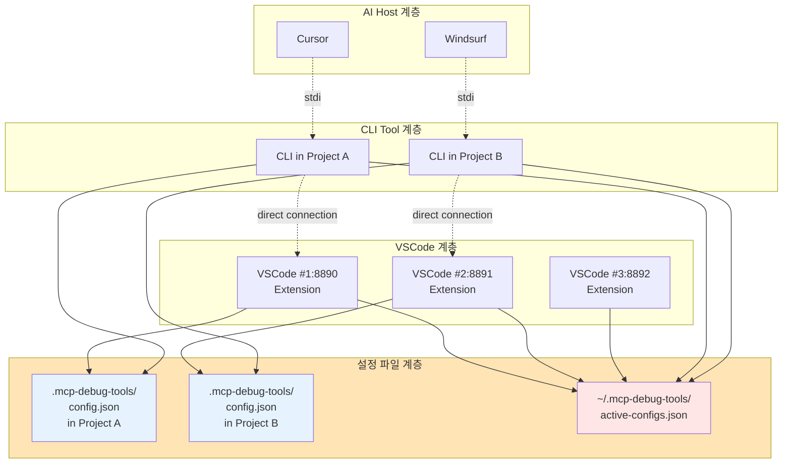
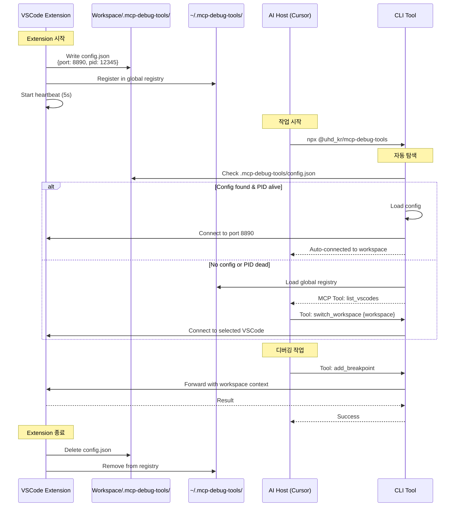
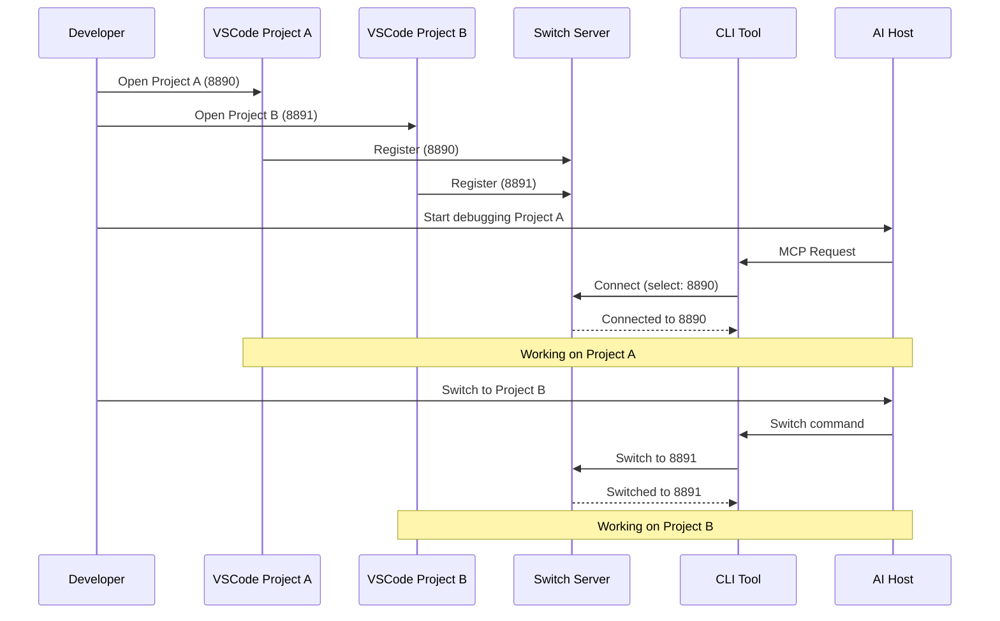
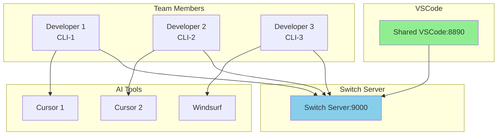
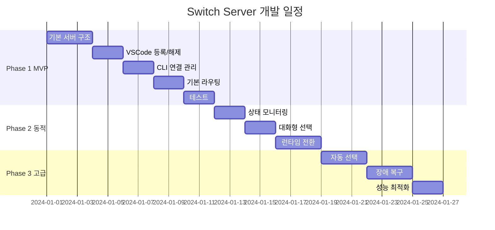

# MCP Debug Tools - Workspace 기반 자동 연결 시스템

## 1. 개요

### 1.1 목표
Workspace 기반 설정 파일을 통해 VSCode Extension과 AI Host 간 자동 연결을 제공하는 간소화된 디버깅 도구

### 1.2 핵심 개념
- **설정 파일 기반**: `.mcp-debug-tools/config.json`으로 연결 정보 공유
- **자동 탐색**: CLI Tool이 현재 workspace의 VSCode 자동 발견
- **Switch Server 불필요**: 복잡한 라우팅 없이 직접 연결
- **다중 인스턴스 지원**: 글로벌 레지스트리로 여러 VSCode 관리

### 1.3 시스템 구성요소
- **VSCode Extension**: MCP 서버 및 설정 파일 생성자
- **Workspace Config**: `.mcp-debug-tools/config.json` 연결 정보
- **Global Registry**: `~/.mcp-debug-tools/active-configs.json` 전체 인스턴스 목록
- **CLI Tool**: AI Host와 연결되는 MCP 클라이언트 (자동 연결)
- **AI Host**: Cursor, Windsurf 등 MCP를 지원하는 AI 도구

## 2. 시스템 아키텍처

### 2.1 전체 구조


### 2.2 연결 플로우


### 2.3 설정 파일 구조
```json
// .mcp-debug-tools/config.json
{
  "version": "1.0.0",
  "instance": {
    "id": "vscode-8890-12345",
    "pid": 12345,
    "port": 8890,
    "startTime": "2024-01-27T10:00:00Z",
    "lastHeartbeat": "2024-01-27T10:05:00Z"
  },
  "workspace": {
    "path": "/Users/user/Projects/my-app",
    "name": "my-app",
    "folders": [{
      "uri": "file:///Users/user/Projects/my-app",
      "name": "my-app"
    }]
  },
  "debugger": {
    "available": true,
    "configurations": ["Node.js", "Chrome"],
    "activeSession": null
  }
}
```

## 3. 상세 프로토콜 명세

### 3.1 VSCode Registration Protocol
```typescript
interface VSCodeRegistration {
  // 요청
  request: {
    port: number;           // VSCode Extension 포트
    workspace: string;      // 워크스페이스 경로
    capabilities: {
      debugger: boolean;    // 디버거 지원 여부
      version: string;      // Extension 버전
    };
    metadata: {
      projectName?: string;
      language?: string[];
      debugConfigs?: string[];
    };
  };
  
  // 응답
  response: {
    id: string;            // 고유 VSCode ID
    token: string;         // 인증 토큰
    heartbeatInterval: number; // 밀리초 단위
  };
}

// 하트비트 프로토콜
interface Heartbeat {
  request: {
    id: string;
    status: 'idle' | 'debugging' | 'busy';
    metrics: {
      activeBreakpoints: number;
      activeSessions: number;
      memoryUsage: number;
    };
  };
  response: {
    acknowledged: boolean;
    commands?: Array<'refresh' | 'reconnect' | 'shutdown'>;
  };
}
```

### 3.2 CLI Connection Protocol
```typescript
interface CLIConnection {
  // 초기 연결
  connect: {
    request: {
      clientId?: string;      // 재연결 시 사용
      selectedPort?: number;  // 특정 포트 선택
      selectionMode: 'manual' | 'auto' | 'interactive';
      preferences?: {
        preferredWorkspace?: string;
        preferredLanguage?: string;
      };
    };
    response: {
      sessionId: string;
      clientId: string;
      connectedPort: number;
      vscodeInfo: {
        workspace: string;
        capabilities: object;
      };
    };
  };
  
  // 동적 전환
  switch: {
    request: {
      sessionId: string;
      targetPort: number;
      reason?: string;
    };
    response: {
      success: boolean;
      previousPort: number;
      currentPort: number;
      vscodeInfo: object;
    };
  };
}
```

### 3.3 MCP Message Routing
```typescript
interface MCPRouting {
  // 요청 라우팅
  request: {
    sessionId: string;
    messageId: string;
    timestamp: number;
    mcpRequest: {
      jsonrpc: '2.0';
      method: string;
      params?: any;
      id: string | number;
    };
  };
  
  // 응답 라우팅
  response: {
    sessionId: string;
    messageId: string;
    timestamp: number;
    mcpResponse: {
      jsonrpc: '2.0';
      result?: any;
      error?: {
        code: number;
        message: string;
        data?: any;
      };
      id: string | number;
    };
  };
  
  // 에러 처리
  error: {
    type: 'routing' | 'timeout' | 'vscode_unavailable';
    message: string;
    details: object;
    fallbackAction?: 'retry' | 'switch' | 'fail';
  };
}
```

## 4. 세션 관리 및 상태 동기화

### 4.1 세션 상태 모델
```typescript
interface SessionState {
  sessionId: string;
  clientId: string;
  createdAt: Date;
  lastActivity: Date;
  
  // 연결 정보
  connection: {
    currentVSCodeId: string;
    currentPort: number;
    previousPorts: number[];
  };
  
  // 세션 메트릭
  metrics: {
    requestCount: number;
    errorCount: number;
    avgResponseTime: number;
    lastError?: string;
  };
  
  // 상태 플래그
  flags: {
    isActive: boolean;
    isDebbuging: boolean;
    isPaused: boolean;
  };
}
```

### 4.2 라우팅 테이블
```typescript
interface RoutingTable {
  // 세션 -> VSCode 매핑
  sessionMappings: Map<string, string>;
  
  // VSCode 인스턴스 풀
  vscodePool: Map<string, {
    id: string;
    port: number;
    status: 'active' | 'inactive' | 'error';
    connectedSessions: Set<string>;
    lastHeartbeat: Date;
    capabilities: object;
  }>;
  
  // 라우팅 규칙
  rules: Array<{
    priority: number;
    name: string;
    condition: (context: RoutingContext) => boolean;
    action: (context: RoutingContext) => string; // VSCode ID
  }>;
}
```

## 5. 고급 기능 명세

### 5.1 자동 VSCode 선택 알고리즘
```typescript
class AutoSelector {
  selectVSCode(context: SelectionContext): string {
    // 1. 워크스페이스 매칭
    if (context.preferredWorkspace) {
      const match = this.findByWorkspace(context.preferredWorkspace);
      if (match) return match;
    }
    
    // 2. 최소 부하 선택
    const leastLoaded = this.findLeastLoaded();
    if (leastLoaded) return leastLoaded;
    
    // 3. 라운드 로빈
    return this.roundRobin();
  }
  
  private findByWorkspace(workspace: string): string | null {
    // 워크스페이스 경로 매칭 로직
  }
  
  private findLeastLoaded(): string {
    // 세션 수가 가장 적은 VSCode 선택
  }
  
  private roundRobin(): string {
    // 순차적 할당
  }
}
```

### 5.2 장애 복구 메커니즘
```typescript
class FailoverManager {
  handleVSCodeFailure(failedId: string): void {
    // 1. 실패한 VSCode의 모든 세션 찾기
    const affectedSessions = this.getAffectedSessions(failedId);
    
    // 2. 대체 VSCode 선택
    for (const session of affectedSessions) {
      const alternative = this.selectAlternative(session);
      
      // 3. 세션 마이그레이션
      this.migrateSession(session, alternative);
      
      // 4. 클라이언트 알림
      this.notifyClient(session, {
        event: 'vscode_switched',
        reason: 'failure',
        newPort: alternative.port
      });
    }
  }
  
  handleNetworkPartition(): void {
    // 네트워크 분할 처리
  }
  
  handleTimeout(sessionId: string): void {
    // 타임아웃 처리
  }
}
```

### 5.3 성능 최적화
```typescript
interface PerformanceOptimization {
  // 연결 풀링
  connectionPool: {
    minConnections: number;
    maxConnections: number;
    idleTimeout: number;
  };
  
  // 캐싱 전략
  caching: {
    responseCache: boolean;
    cacheTTL: number;
    cacheSize: number;
  };
  
  // 배치 처리
  batching: {
    enabled: boolean;
    maxBatchSize: number;
    batchTimeout: number;
  };
  
  // 압축
  compression: {
    enabled: boolean;
    algorithm: 'gzip' | 'deflate' | 'brotli';
    threshold: number; // bytes
  };
}
```

## 6. 구현 계획

### 6.1 프로젝트 구조
```
mcp-debug-tools/
├── packages/
│   ├── switch-server/           # On-Demand 서버
│   │   ├── src/
│   │   │   ├── index.ts
│   │   │   ├── server.ts
│   │   │   ├── lifecycle-manager.ts
│   │   │   ├── connection-tracker.ts
│   │   │   ├── registry.ts
│   │   │   ├── session.ts
│   │   │   └── router.ts
│   │   └── package.json
│   │
│   ├── vscode-extension/
│   │   └── src/
│   │       ├── extension.ts
│   │       └── switch-server-manager.ts
│   │
│   └── cli-tool/
│       └── src/
│           ├── cli.ts
│           └── switch-connector.ts
```

### 6.2 Phase 1: Switch Server 라이프사이클 구현
```typescript
// switch-server/src/lifecycle-manager.ts
export class LifecycleManager {
  private connectionCount = 0;
  private sessionCount = 0;
  private shutdownTimer?: NodeJS.Timer;
  private readonly SHUTDOWN_DELAY = 30000;
  
  onConnectionAdded(type: 'vscode' | 'cli') {
    this.connectionCount++;
    this.cancelShutdown();
    console.log(`Connection added: ${type}, Total: ${this.connectionCount}`);
  }
  
  onConnectionRemoved(type: 'vscode' | 'cli') {
    this.connectionCount--;
    console.log(`Connection removed: ${type}, Remaining: ${this.connectionCount}`);
    this.checkShutdownCondition();
  }
  
  private checkShutdownCondition() {
    if (this.connectionCount === 0 && this.sessionCount === 0) {
      console.log('No active connections. Scheduling shutdown...');
      this.scheduleShutdown();
    }
  }
  
  private scheduleShutdown() {
    this.shutdownTimer = setTimeout(() => {
      this.performGracefulShutdown();
    }, this.SHUTDOWN_DELAY);
  }
  
  private async performGracefulShutdown() {
    console.log('Performing graceful shutdown...');
    await this.server.saveState();
    await this.server.cleanup();
    process.exit(0);
  }
}
```

### 6.3 Phase 2: Extension의 자동 시작 관리
```typescript
// vscode-extension/src/switch-server-manager.ts
export class SwitchServerManager {
  private static SWITCH_SERVER_PORT = 9000;
  private registrationId?: string;
  
  async ensureServerRunning(): Promise<boolean> {
    // 1. 서버 상태 확인
    if (await this.isServerHealthy()) {
      return true;
    }
    
    // 2. 서버 시작
    const serverPath = this.findSwitchServerExecutable();
    if (!serverPath) {
      return false;
    }
    
    // 3. Detached 모드로 서버 프로세스 시작
    const serverProcess = spawn('node', [serverPath], {
      detached: true,
      stdio: 'ignore',
      env: {
        ...process.env,
        SWITCH_SERVER_PORT: '9000',
        SWITCH_SERVER_MODE: 'auto-shutdown'
      }
    });
    
    serverProcess.unref(); // Extension과 분리
    
    // 4. 서버 시작 대기
    return await this.waitForServerReady();
  }
  
  async registerWithServer() {
    const response = await fetch(
      `http://localhost:${SwitchServerManager.SWITCH_SERVER_PORT}/api/vscode/register`,
      {
        method: 'POST',
        headers: { 'Content-Type': 'application/json' },
        body: JSON.stringify({
          port: this.localPort,
          workspace: vscode.workspace.workspaceFolders?.[0]?.uri.fsPath,
          pid: process.pid
        })
      }
    );
    
    const data = await response.json();
    this.registrationId = data.id;
    
    // 하트비트 시작
    this.startHeartbeat();
  }
  
  async unregisterFromServer() {
    if (this.registrationId) {
      await fetch(
        `http://localhost:${SwitchServerManager.SWITCH_SERVER_PORT}/api/vscode/${this.registrationId}`,
        { method: 'DELETE' }
      );
    }
  }
}
```

### 6.4 Phase 3: 연결 추적 및 세션 관리
```typescript
// switch-server/src/connection-tracker.ts
export class ConnectionTracker {
  private connections = new Map<string, ConnectionInfo>();
  private lifecycleManager: LifecycleManager;
  
  addVSCodeConnection(info: VSCodeConnectionInfo): string {
    const id = generateId();
    this.connections.set(id, {
      id,
      type: 'vscode',
      connectedAt: new Date(),
      ...info
    });
    
    this.lifecycleManager.onConnectionAdded('vscode');
    return id;
  }
  
  removeConnection(id: string): void {
    const conn = this.connections.get(id);
    if (conn) {
      this.connections.delete(id);
      this.lifecycleManager.onConnectionRemoved(conn.type);
    }
  }
  
  getActiveVSCodes(): VSCodeConnectionInfo[] {
    return Array.from(this.connections.values())
      .filter(c => c.type === 'vscode');
  }
}
```

## 7. REST API 상세 명세

### 7.1 VSCode Management APIs
```yaml
# VSCode 등록
POST /api/vscode/register
Request:
  Content-Type: application/json
  Body:
    port: integer (required)
    workspace: string (required)
    capabilities:
      debugger: boolean
      version: string
    metadata: object (optional)
Response:
  200 OK:
    id: string
    token: string
    heartbeatInterval: integer
  400 Bad Request:
    error: string
  409 Conflict:
    error: "Port already registered"

# VSCode 해제
DELETE /api/vscode/:id
Headers:
  Authorization: Bearer {token}
Response:
  204 No Content
  404 Not Found

# VSCode 목록 조회
GET /api/vscode
Response:
  200 OK:
    vscodes: [
      {
        id: string
        port: integer
        workspace: string
        status: "active" | "inactive"
        connectedSessions: integer
        lastHeartbeat: ISO8601
      }
    ]

# VSCode 상태 조회
GET /api/vscode/:id
Response:
  200 OK:
    id: string
    port: integer
    workspace: string
    status: string
    metrics: object
    sessions: [sessionId]
```

### 7.2 CLI Session APIs
```yaml
# CLI 연결
POST /api/cli/connect
Request:
  Body:
    clientId: string (optional)
    selectedPort: integer (optional)
    selectionMode: "manual" | "auto" | "interactive"
Response:
  200 OK:
    sessionId: string
    clientId: string
    connectedPort: integer
    vscodeInfo: object

# 세션 전환
POST /api/session/:id/switch
Request:
  Body:
    targetPort: integer
    reason: string (optional)
Response:
  200 OK:
    success: boolean
    previousPort: integer
    currentPort: integer

# 세션 종료
DELETE /api/session/:id
Response:
  204 No Content

# 세션 정보
GET /api/session/:id
Response:
  200 OK:
    sessionId: string
    clientId: string
    currentPort: integer
    createdAt: ISO8601
    lastActivity: ISO8601
    metrics: object
```

### 7.3 MCP Proxy APIs
```yaml
# MCP 메시지 프록시
POST /api/mcp/proxy
Headers:
  X-Session-Id: string
Request:
  Body: MCP Request Object
Response:
  200 OK: MCP Response Object
  404 Not Found: VSCode not available
  500 Internal Server Error

# 배치 요청
POST /api/mcp/batch
Headers:
  X-Session-Id: string
Request:
  Body:
    requests: [MCP Request Objects]
Response:
  200 OK:
    responses: [MCP Response Objects]
```

## 8. WebSocket Protocol

### 8.1 실시간 연결
```typescript
// WebSocket 연결
ws://localhost:9000/ws

// 메시지 타입
interface WebSocketMessage {
  type: 'auth' | 'switch' | 'status' | 'mcp' | 'error';
  payload: any;
}

// 인증
→ { type: 'auth', payload: { sessionId: string } }
← { type: 'auth', payload: { success: boolean } }

// VSCode 전환
→ { type: 'switch', payload: { targetPort: number } }
← { type: 'switch', payload: { currentPort: number } }

// MCP 메시지
→ { type: 'mcp', payload: MCPRequest }
← { type: 'mcp', payload: MCPResponse }
```

## 9. 구성 파일 및 환경 설정

### 9.1 Switch Server 구성
```yaml
# switch-server.yaml
server:
  host: 0.0.0.0
  port: 9000
  cors:
    enabled: true
    origins: ["http://localhost:*"]
  
logging:
  level: info
  file: ./logs/switch-server.log
  
vscode:
  heartbeatInterval: 5000
  timeoutThreshold: 15000
  maxInstances: 10
  
sessions:
  maxPerClient: 5
  idleTimeout: 3600000  # 1 hour
  
routing:
  defaultStrategy: manual
  rules:
    - name: workspace-match
      priority: 1
      condition:
        type: workspace
        pattern: "*/projectA/*"
      target:
        port: 8890
    
    - name: load-balance
      priority: 2
      condition:
        type: always
      target:
        strategy: least-connections
  
performance:
  connectionPool:
    min: 2
    max: 10
  cache:
    enabled: true
    ttl: 60
  compression:
    enabled: true
    threshold: 1024
```

### 9.2 환경 변수
```bash
# .env
SWITCH_SERVER_PORT=9000
SWITCH_SERVER_HOST=localhost
LOG_LEVEL=debug
ENABLE_METRICS=true
METRICS_PORT=9001

# VSCode 관련
VSCODE_HEARTBEAT_INTERVAL=5000
VSCODE_TIMEOUT_THRESHOLD=15000

# 세션 관련
SESSION_IDLE_TIMEOUT=3600000
MAX_SESSIONS_PER_CLIENT=5

# 성능 관련
ENABLE_CACHE=true
CACHE_TTL=60
ENABLE_COMPRESSION=true
```

## 10. 테스트 전략

### 10.1 유닛 테스트
```typescript
describe('SwitchServer', () => {
  describe('VSCode Registration', () => {
    it('should register new VSCode instance');
    it('should reject duplicate ports');
    it('should handle heartbeat timeout');
  });
  
  describe('Session Management', () => {
    it('should create new session');
    it('should switch VSCode instance');
    it('should cleanup idle sessions');
  });
  
  describe('Routing', () => {
    it('should route to correct VSCode');
    it('should apply routing rules');
    it('should handle VSCode unavailable');
  });
});
```

### 10.2 통합 테스트
```typescript
describe('E2E Scenarios', () => {
  it('Scenario 1: Multiple VSCode, Single CLI');
  it('Scenario 2: Single VSCode, Multiple CLI');
  it('Scenario 3: Dynamic switching during debug');
  it('Scenario 4: VSCode failure recovery');
  it('Scenario 5: High load handling');
});
```

### 10.3 성능 테스트
```yaml
Performance Targets:
  - Concurrent connections: 100+
  - Request latency: < 50ms
  - Throughput: 1000 req/sec
  - Memory usage: < 256MB
  - CPU usage: < 50%
```

## 11. 보안 고려사항

### 11.1 인증 및 권한
```typescript
interface Security {
  authentication: {
    method: 'token' | 'none';
    tokenValidation: boolean;
  };
  
  authorization: {
    enabled: boolean;
    rules: Array<{
      resource: string;
      actions: string[];
      conditions: object;
    }>;
  };
  
  encryption: {
    transport: 'tls' | 'none';
    atRest: boolean;
  };
}
```

### 11.2 보안 베스트 프랙티스
- 로컬호스트 전용 바인딩
- 토큰 기반 세션 관리
- Rate limiting
- Input validation
- SQL injection 방지
- XSS 방지

## 12. 모니터링 및 디버깅

### 12.1 모니터링 대시보드
```typescript
interface MonitoringDashboard {
  // 실시간 메트릭
  metrics: {
    activeVSCodes: number;
    activeSessions: number;
    requestsPerSecond: number;
    avgLatency: number;
    errorRate: number;
  };
  
  // VSCode 상태
  vscodeStatus: Map<string, {
    id: string;
    port: number;
    status: 'healthy' | 'unhealthy' | 'unknown';
    lastHeartbeat: Date;
    connectedSessions: string[];
  }>;
  
  // 세션 상태
  sessionStatus: Map<string, {
    id: string;
    clientId: string;
    currentVSCode: string;
    requestCount: number;
    lastActivity: Date;
  }>;
  
  // 알림
  alerts: Array<{
    level: 'info' | 'warning' | 'error';
    message: string;
    timestamp: Date;
  }>;
}

// 모니터링 엔드포인트
GET /api/monitor/dashboard
GET /api/monitor/metrics
GET /api/monitor/health
GET /api/monitor/logs
```

### 12.2 디버깅 도구
```bash
# Switch Server CLI 도구
switch-server-cli status           # 전체 상태 조회
switch-server-cli vscode list      # VSCode 목록
switch-server-cli session list     # 세션 목록
switch-server-cli route test       # 라우팅 테스트
switch-server-cli logs tail        # 실시간 로그

# 디버그 모드
DEBUG=switch:* node switch-server.js
```

## 13. 예상 사용 시나리오 상세

### 13.1 시나리오: 개발자 멀티 프로젝트 작업


### 13.2 시나리오: 팀 협업 디버깅


### 13.3 시나리오: 장애 복구
```typescript
// VSCode 장애 시나리오
1. VSCode #1 (8890) 응답 없음
2. Switch Server 감지 (heartbeat timeout)
3. 영향받는 세션 식별
4. 대체 VSCode 선택 (8891)
5. 세션 자동 마이그레이션
6. 클라이언트 알림
7. 작업 계속

// 네트워크 장애 시나리오
1. CLI-Switch 연결 끊김
2. CLI 재연결 시도
3. Switch Server 세션 복구
4. 이전 상태 복원
5. 작업 재개
```

## 14. 구현 우선순위 및 일정

### 14.1 개발 로드맵


### 14.2 리스크 및 대응 방안
| 리스크 | 영향도 | 확률 | 대응 방안 |
|--------|--------|------|-----------|
| VSCode API 제약 | 높음 | 중간 | 대체 API 조사, 우회 방법 개발 |
| 성능 병목 | 중간 | 중간 | 캐싱, 연결 풀링, 로드 밸런싱 |
| 동시성 이슈 | 높음 | 낮음 | 락 메커니즘, 트랜잭션 관리 |
| 네트워크 지연 | 중간 | 중간 | 타임아웃 설정, 재시도 로직 |

## 15. 결론 및 다음 단계

### 15.1 핵심 성과
- **문제 해결**: 다중 VSCode 인스턴스 관리 문제 해결
- **유연성**: N:M 라우팅으로 다양한 시나리오 지원
- **확장성**: 추가 기능 및 플러그인 지원 가능
- **안정성**: 장애 복구 및 세션 관리

### 15.2 다음 단계
1. **프로토타입 개발**: Phase 1 MVP 구현
2. **테스트 환경 구축**: 단위/통합 테스트
3. **사용자 피드백**: 베타 테스트 진행
4. **문서화**: API 문서 및 사용자 가이드
5. **배포 준비**: 패키징 및 배포 전략

### 15.3 예상 결과물
- Switch Server 실행 파일
- VSCode Extension 수정 패치
- CLI Tool 업데이트
- API 문서
- 사용자 가이드
- 테스트 스위트

## 16. 부록

### 16.1 용어 정의
- **Switch Server**: 중앙 라우팅 서버
- **VSCode Instance**: 개별 VSCode 창과 Extension
- **Session**: CLI와 VSCode 간 연결 세션
- **Routing**: 요청을 적절한 VSCode로 전달

### 16.2 참고 자료
- [MCP Specification](https://modelcontextprotocol.io/)
- [Debug Adapter Protocol](https://microsoft.github.io/debug-adapter-protocol/)
- [VSCode Extension API](https://code.visualstudio.com/api)
- [Express.js Documentation](https://expressjs.com/)

### 16.3 연락처
- 프로젝트 관리자: [이메일]
- 기술 지원: [이메일]
- GitHub: [저장소 URL]

---

**문서 버전**: 1.0.0
**작성일**: 2024-01-27
**최종 수정일**: 2024-01-27
**상태**: 검토 중