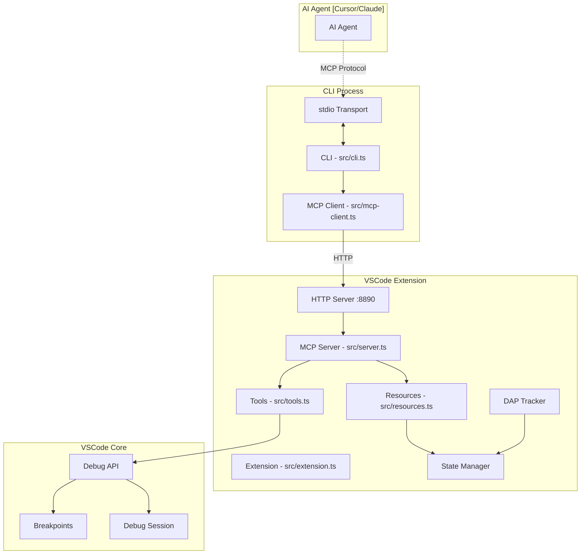

# MCP Debug Tools - Tool 아키텍처 문서

## 📋 개요
이 프로젝트는 VSCode 디버깅 기능을 MCP (Model Context Protocol)를 통해 AI 에이전트에게 노출하는 도구입니다. Debug Adapter Protocol (DAP)과 MCP를 브릿지하여 AI가 디버깅 작업을 수행할 수 있게 합니다.

## 🏗️ 전체 아키텍처



## 🛠️ Tool 카테고리 분류

### 1. 브레이크포인트 관리 도구 (5개)
- `add-breakpoint` - 단일 브레이크포인트 추가
- `add-breakpoints` - 다수 브레이크포인트 일괄 추가
- `remove-breakpoint` - 특정 브레이크포인트 제거
- `clear-breakpoints` - 브레이크포인트 일괄 제거
- `list-breakpoints` - 모든 브레이크포인트 목록 조회

### 2. 디버그 세션 제어 도구 (7개)
- `start-debug` - 디버그 세션 시작
- `stop-debug` - 디버그 세션 종료
- `continue` - 실행 계속
- `step-over` - 한 줄 실행 (함수 건너뛰기)
- `step-into` - 함수 내부로 들어가기
- `step-out` - 현재 함수 밖으로 나가기
- `pause` - 실행 일시 중지

### 3. 디버그 상태 조회 도구 (3개)
- `get-debug-state` - 현재 디버그 상태 조회
- `evaluate-expression` - 표현식 평가
- `inspect-variable` - 특정 변수 검사

### 4. 디버그 구성 관리 도구 (2개)
- `list-debug-configs` - launch.json의 모든 디버그 구성 목록
- `select-debug-config` - 특정 디버그 구성 선택

### 5. 고급 정보 조회 도구 (9개)
- `get-dap-log` - DAP 프로토콜 메시지 로그
- `get-breakpoints` - 브레이크포인트 상세 정보
- `get-active-session` - 활성 세션 정보
- `get-debug-console` - 디버그 콘솔 출력
- `get-active-stack-item` - 현재 포커스된 스택 아이템
- `get-call-stack` - 콜스택 정보
- `get-variables-scope` - 변수 및 스코프 정보
- `get-thread-list` - 스레드 목록
- `get-exception-info` - 예외 정보

### 6. VSCode 인스턴스 관리 도구 (3개)
- `select-vscode-instance` - 특정 VSCode 인스턴스 선택
- `get-workspace-info` - 현재 workspace 정보
- `list-vscode-instances` - 모든 활성 VSCode 인스턴스 목록

**총 29개 도구**

## 📚 Resource 목록 (9개)

1. `dap-log` - DAP 프로토콜 메시지 로그
2. `breakpoints` - 현재 브레이크포인트 목록
3. `active-session` - 활성 디버그 세션 정보
4. `debug-console` - 디버그 콘솔 출력
5. `active-stack-item` - 현재 포커스된 스택 아이템
6. `call-stack` - 콜스택 정보
7. `variables-scope` - 변수 및 스코프 정보
8. `thread-list` - 스레드 목록
9. `exception-info` - 예외 정보

## 🔄 Tool 등록 및 실행 흐름

### 1. Tool 등록 과정
```typescript
// src/server.ts - initializeMcpServer()
1. McpServer 인스턴스 생성
2. allTools 배열의 모든 도구 순회
3. mcpServer.registerTool() 호출로 각 도구 등록
   - name: 도구 이름
   - config: 제목, 설명, 입력 스키마
   - handler: 비동기 핸들러 함수
```

### 2. Tool 실행 과정
```typescript
1. AI Agent가 MCP를 통해 도구 호출
2. CLI가 stdio로 요청 수신
3. MCP Client가 HTTP로 VSCode Extension에 전달
4. MCP Server가 등록된 handler 실행
5. handler가 VSCode Debug API 호출
6. 결과를 다시 AI Agent에게 반환
```

## 🌐 통신 프로토콜

### HTTP Server 구조
- **포트**: 8890 (기본값, 사용 중이면 다른 포트 자동 할당)
- **엔드포인트**: `/mcp`
- **메소드**: 
  - POST: 클라이언트→서버 통신
  - GET: 서버→클라이언트 알림 (SSE)
  - DELETE: 세션 종료

### 세션 관리
- 각 클라이언트는 고유한 세션 ID 부여
- StreamableHTTPServerTransport로 양방향 통신
- 세션별 Transport 인스턴스 관리

## 📁 핵심 파일 구조

```
src/
├── tools.ts              # 모든 Tool 정의 (1749줄)
├── tools-parameters.ts   # Tool 파라미터 스키마 (Zod)
├── resources.ts          # Resource 정의
├── server.ts            # MCP 서버 및 HTTP 서버
├── mcp-client.ts        # MCP 클라이언트 (프록시)
├── cli.ts               # CLI 진입점
├── extension.ts         # VSCode 확장 진입점
├── state.ts             # 전역 상태 관리
├── dap-tracker.ts       # DAP 메시지 추적
├── config-manager.ts    # 설정 파일 관리
├── registry-manager.ts  # 글로벌 레지스트리
└── config-finder.ts     # VSCode 인스턴스 자동 탐색
```

## 🔧 Tool 구현 패턴

### 기본 Tool 구조
```typescript
export const toolNameTool = {
    name: 'tool-name',
    config: {
        title: 'Tool Title',
        description: 'Tool description',
        inputSchema: inputSchemas['tool-name']  // Zod 스키마
    },
    handler: async (args: any) => {
        try {
            // 1. 파라미터 추출
            const { param1, param2 } = args
            
            // 2. VSCode API 호출
            const result = await vscode.debug.someMethod()
            
            // 3. 결과 반환
            return {
                content: [{
                    type: 'text' as const,
                    text: JSON.stringify(result, null, 2)
                }]
            }
        } catch (error: any) {
            return {
                content: [{ 
                    type: 'text' as const, 
                    text: `Error: ${error.message}` 
                }],
                isError: true
            }
        }
    }
}
```

## 🚀 자동 연결 기능

### CLI 자동 탐색 순서
1. **현재 디렉토리부터 상위로 탐색**
   - `.mcp-debug-tools/config.json` 파일 찾기
   - 15초 이내 heartbeat 확인

2. **글로벌 레지스트리 확인**
   - `~/.mcp-debug-tools/active-configs.json`
   - 모든 활성 VSCode 인스턴스 목록

3. **자동 선택 로직**
   - 인스턴스 1개: 자동 선택
   - 인스턴스 여러 개: 첫 번째 자동 선택
   - 수동으로 `--port` 옵션 지정 가능

## 📊 상태 관리

### ExtensionState 클래스
- MCP Server 인스턴스
- HTTP Server 인스턴스
- DAP 메시지 로그 (배열)
- Transport 세션 맵
- 서버 포트 및 시작 시간
- 활성 웹뷰 패널 목록

### ConfigManager
- Workspace별 설정 파일 관리
- 10초마다 heartbeat 업데이트
- PID 및 포트 정보 저장

### RegistryManager
- 글로벌 레지스트리 파일 관리
- 모든 VSCode 인스턴스 추적
- Stale 인스턴스 자동 정리

## 🔐 보안 및 제약사항

### 보안
- 로컬호스트 전용 (외부 접근 차단)
- DNS 리바인딩 보호 비활성화 (로컬 개발용)
- 세션별 격리

### 제약사항
- logMessage 브레이크포인트 미지원 (VSCode API 제약)
- 일부 DAP 기능은 디버거 종류에 따라 차이
- 동시 다중 세션 지원 제한

## 🎯 사용 예시

### AI Agent에서 브레이크포인트 설정
```javascript
// Tool 호출
await callTool('add-breakpoint', {
    file: 'src/app.js',
    line: 42,
    condition: 'count > 10'
});
```

### 디버그 세션 시작
```javascript
await callTool('start-debug', {
    config: 'Launch Program'
});
```

### 변수 검사
```javascript
const result = await callTool('inspect-variable', {
    variableName: 'myVariable'
});
```

## 📈 향후 개선 방향

1. **Tool 확장**
   - Watch expressions 지원
   - Conditional breakpoints 개선
   - Data breakpoints 추가

2. **성능 최적화**
   - 대량 브레이크포인트 처리 개선
   - DAP 메시지 스트리밍 최적화

3. **사용성 개선**
   - Tool 자동 완성 지원
   - 에러 메시지 개선
   - 상태 시각화 강화

## 📝 주의사항

1. VSCode 확장이 먼저 실행되어야 함
2. 디버그 세션이 활성화되어야 일부 도구 사용 가능
3. launch.json 파일이 있어야 디버그 구성 관련 기능 사용 가능