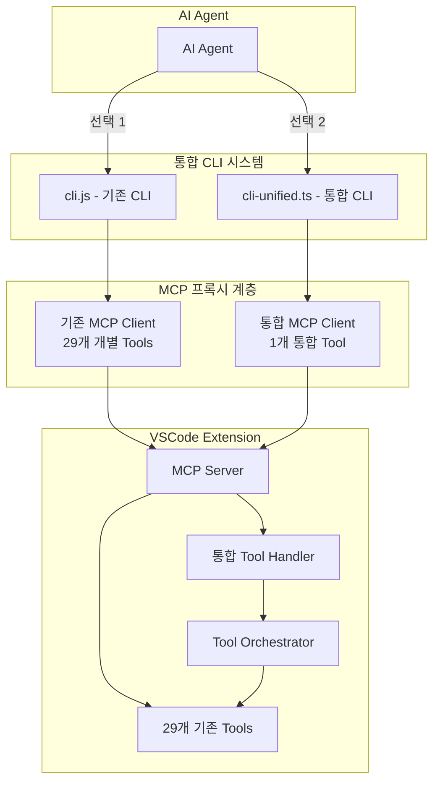

# 통합형 Tool 설계 문서

## 🎯 설계 목표

### 핵심 요구사항
1. **단일 호출 다중 작업**: 한 번의 Tool 호출로 여러 디버깅 작업 수행
2. **호환성 유지**: 기존 cli.js는 개별 Tool 방식 유지
3. **통합 인터페이스**: 새로운 cli-unified.ts는 통합형 Tool 제공
4. **구조화된 응답**: 여러 작업 결과를 체계적으로 반환

## 📐 아키텍처 설계



## 🔧 통합형 Tool 인터페이스

### Tool 이름: `debug-command`

### 입력 스키마
```typescript
interface DebugCommandInput {
  // 실행할 작업 목록
  operations: Operation[];
  
  // 전역 옵션
  options?: {
    // 트랜잭션 모드: 하나라도 실패하면 전체 롤백
    transactional?: boolean;
    
    // 병렬 실행 허용 (의존성이 없는 작업들)
    parallel?: boolean;
    
    // 상세 메타데이터 포함
    includeMetadata?: boolean;
    
    // 응답 포맷
    format?: 'json' | 'structured' | 'flat';
    
    // 타임아웃 (ms)
    timeout?: number;
  };
}

interface Operation {
  // 작업 ID (응답에서 참조용)
  id?: string;
  
  // 작업 카테고리
  category: 'breakpoint' | 'session' | 'state' | 'config' | 'info' | 'workspace';
  
  // 수행할 액션
  action: string;
  
  // 액션별 파라미터
  params?: any;
  
  // 이 작업이 의존하는 다른 작업 ID
  dependsOn?: string[];
  
  // 조건부 실행
  condition?: {
    // 특정 작업이 성공했을 때만 실행
    ifSuccess?: string;
    // 특정 작업이 실패했을 때만 실행
    ifFailed?: string;
  };
}
```

### 작업 카테고리 및 액션 매핑

```typescript
const OPERATION_MAPPING = {
  breakpoint: {
    add: 'add-breakpoint',
    addMultiple: 'add-breakpoints',
    remove: 'remove-breakpoint',
    clear: 'clear-breakpoints',
    list: 'list-breakpoints'
  },
  session: {
    start: 'start-debug',
    stop: 'stop-debug',
    continue: 'continue',
    stepOver: 'step-over',
    stepInto: 'step-into',
    stepOut: 'step-out',
    pause: 'pause'
  },
  state: {
    getDebugState: 'get-debug-state',
    evaluate: 'evaluate-expression',
    inspect: 'inspect-variable'
  },
  config: {
    listConfigs: 'list-debug-configs',
    selectConfig: 'select-debug-config'
  },
  info: {
    getDapLog: 'get-dap-log',
    getBreakpoints: 'get-breakpoints',
    getActiveSession: 'get-active-session',
    getConsole: 'get-debug-console',
    getStackItem: 'get-active-stack-item',
    getCallStack: 'get-call-stack',
    getVariables: 'get-variables-scope',
    getThreads: 'get-thread-list',
    getException: 'get-exception-info'
  },
  workspace: {
    selectInstance: 'select-vscode-instance',
    getInfo: 'get-workspace-info',
    listInstances: 'list-vscode-instances'
  }
};
```

### 출력 스키마
```typescript
interface DebugCommandOutput {
  // 실행 요약
  summary: {
    totalOperations: number;
    successful: number;
    failed: number;
    skipped: number;
    executionTime: number; // ms
  };
  
  // 각 작업 결과
  results: OperationResult[];
  
  // 전체 실행 메타데이터
  metadata?: {
    startTime: string;
    endTime: string;
    vsCodeInstance: {
      port: number;
      workspace: string;
    };
    debugSession?: {
      active: boolean;
      name?: string;
      type?: string;
    };
  };
}

interface OperationResult {
  // 작업 ID
  id: string;
  
  // 실행한 작업
  operation: {
    category: string;
    action: string;
  };
  
  // 실행 상태
  status: 'success' | 'failed' | 'skipped';
  
  // 작업 결과 데이터
  data?: any;
  
  // 에러 정보
  error?: {
    code: string;
    message: string;
    details?: any;
  };
  
  // 실행 메타데이터
  metadata?: {
    executionTime: number;
    timestamp: string;
    skippedReason?: string;
  };
}
```

## 📝 사용 예시

### 예시 1: 디버깅 세션 시작 및 브레이크포인트 설정
```typescript
{
  operations: [
    {
      id: "config-1",
      category: "config",
      action: "selectConfig",
      params: { configName: "Launch Program" }
    },
    {
      id: "bp-1",
      category: "breakpoint",
      action: "addMultiple",
      params: {
        breakpoints: [
          { file: "src/main.ts", line: 10 },
          { file: "src/utils.ts", line: 25, condition: "count > 5" }
        ]
      }
    },
    {
      id: "session-1",
      category: "session",
      action: "start",
      params: { config: "Launch Program" },
      dependsOn: ["config-1", "bp-1"]
    },
    {
      id: "state-1",
      category: "state",
      action: "getDebugState",
      dependsOn: ["session-1"]
    }
  ],
  options: {
    transactional: false,
    parallel: false,
    includeMetadata: true
  }
}
```

### 예시 2: 현재 상태 종합 조회
```typescript
{
  operations: [
    {
      category: "info",
      action: "getActiveSession"
    },
    {
      category: "info",
      action: "getBreakpoints"
    },
    {
      category: "info",
      action: "getCallStack"
    },
    {
      category: "info",
      action: "getVariables"
    }
  ],
  options: {
    parallel: true,
    format: "structured"
  }
}
```

### 예시 3: 조건부 실행
```typescript
{
  operations: [
    {
      id: "check-session",
      category: "info",
      action: "getActiveSession"
    },
    {
      id: "stop-if-active",
      category: "session",
      action: "stop",
      condition: {
        ifSuccess: "check-session"
      }
    },
    {
      id: "start-new",
      category: "session",
      action: "start",
      params: { config: "Debug Test" },
      dependsOn: ["stop-if-active"]
    }
  ]
}
```

## 🚀 새로운 CLI 설계 (cli-unified.ts)

### CLI 구조
```typescript
// src/cli-unified.ts
class UnifiedCLI {
  private mcpClient: UnifiedMcpClient;
  
  constructor() {
    // 통합형 Tool만 등록
    this.registerUnifiedTool();
  }
  
  private registerUnifiedTool() {
    // debug-command Tool 등록
    this.mcpClient.registerTool('debug-command', {
      title: 'Unified Debug Command',
      description: 'Execute multiple debug operations in a single call',
      inputSchema: unifiedToolSchema,
      handler: this.handleUnifiedCommand
    });
  }
  
  private async handleUnifiedCommand(input: DebugCommandInput) {
    const orchestrator = new ToolOrchestrator();
    return await orchestrator.execute(input);
  }
}
```

### Tool Orchestrator
```typescript
class ToolOrchestrator {
  private toolRegistry: Map<string, Tool>;
  private executionContext: ExecutionContext;
  
  async execute(input: DebugCommandInput): Promise<DebugCommandOutput> {
    // 1. 의존성 그래프 구성
    const graph = this.buildDependencyGraph(input.operations);
    
    // 2. 실행 순서 결정
    const executionOrder = this.topologicalSort(graph);
    
    // 3. 작업 실행
    const results = [];
    for (const batch of executionOrder) {
      if (input.options?.parallel) {
        // 병렬 실행
        const batchResults = await Promise.all(
          batch.map(op => this.executeOperation(op))
        );
        results.push(...batchResults);
      } else {
        // 순차 실행
        for (const op of batch) {
          const result = await this.executeOperation(op);
          results.push(result);
          
          // 트랜잭션 모드에서 실패 시 중단
          if (input.options?.transactional && result.status === 'failed') {
            break;
          }
        }
      }
    }
    
    // 4. 결과 조합
    return this.combineResults(results, input);
  }
  
  private async executeOperation(op: Operation): Promise<OperationResult> {
    const toolName = OPERATION_MAPPING[op.category][op.action];
    const tool = this.toolRegistry.get(toolName);
    
    try {
      const result = await tool.handler(op.params);
      return {
        id: op.id || generateId(),
        operation: { category: op.category, action: op.action },
        status: 'success',
        data: result,
        metadata: { 
          executionTime: Date.now() - startTime,
          timestamp: new Date().toISOString()
        }
      };
    } catch (error) {
      return {
        id: op.id || generateId(),
        operation: { category: op.category, action: op.action },
        status: 'failed',
        error: {
          code: error.code || 'UNKNOWN_ERROR',
          message: error.message,
          details: error
        }
      };
    }
  }
}
```

## 🔄 기존 CLI와의 호환성 전략

### 1. 패키지 구조
```
mcp-debug-tools/
├── src/
│   ├── cli.ts           # 기존 CLI (29개 개별 Tools)
│   ├── cli-unified.ts   # 새 CLI (1개 통합 Tool)
│   ├── mcp-client.ts    # 기존 프록시
│   ├── mcp-client-unified.ts # 통합 프록시
│   └── tools/
│       ├── index.ts     # 기존 Tools
│       └── unified-tool.ts # 통합 Tool
└── package.json
```

### 2. package.json 설정
```json
{
  "bin": {
    "mcp-debug": "./out/cli.js",
    "mcp-debug-unified": "./out/cli-unified.js"
  }
}
```

### 3. 사용 방법
```bash
# 기존 방식 (개별 Tools)
npx mcp-debug --port=8890

# 통합 방식 (통합 Tool)
npx mcp-debug-unified --port=8890
```

## 📊 성능 최적화 전략

### 1. 병렬 실행
- 의존성이 없는 작업들을 동시에 실행
- Promise.all()을 활용한 병렬 처리

### 2. 캐싱
- 동일한 정보 조회 작업 결과 캐싱
- TTL 기반 캐시 무효화

### 3. 배치 처리
- 유사한 작업들을 그룹화하여 처리
- 예: 여러 브레이크포인트 추가를 한 번에

## 🔐 에러 처리 전략

### 1. Graceful Degradation
- 일부 작업 실패 시에도 나머지 계속 실행
- 실패한 작업 정보를 명확히 반환

### 2. Rollback 지원
- transactional 모드에서 실패 시 이전 상태로 복원
- 각 작업의 undo 작업 정의

### 3. 상세한 에러 정보
- 에러 코드 체계 정립
- 디버깅에 도움되는 상세 정보 포함

## 📈 확장성 고려사항

### 1. 플러그인 시스템
- 새로운 작업 카테고리 추가 용이
- 커스텀 작업 정의 지원

### 2. 프리셋 지원
- 자주 사용하는 작업 조합을 프리셋으로 저장
- 예: "start-debugging-preset", "inspect-all-preset"

### 3. 매크로 기능
- 복잡한 작업 시퀀스를 매크로로 정의
- 파라미터화된 매크로 지원

## 🎯 구현 우선순위

### Phase 1: 기본 구조 (1주)
- [ ] UnifiedTool 인터페이스 정의
- [ ] ToolOrchestrator 구현
- [ ] cli-unified.ts 기본 구조

### Phase 2: 핵심 기능 (1주)
- [ ] 의존성 관리 시스템
- [ ] 병렬/순차 실행 로직
- [ ] 기본 에러 처리

### Phase 3: 고급 기능 (1주)
- [ ] 조건부 실행
- [ ] 트랜잭션 모드
- [ ] 캐싱 시스템

### Phase 4: 최적화 (1주)
- [ ] 성능 최적화
- [ ] 프리셋 시스템
- [ ] 테스트 및 문서화